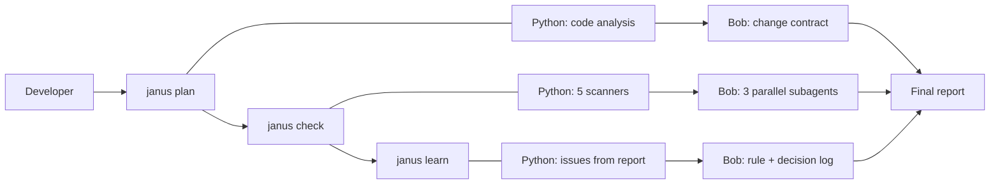

# Janus

Looks before. Checks after. Never forgets.

Janus is an IBM Bob 2.0 workflow that keeps a repository honest. Before a change, it tells you what the change will touch. After the change, it checks that config, docs and secrets still match the code, and fixes what drifted. Then it writes a rule so Bob never repeats the same mistake.

Built for the IBM Bob 2.0 Hackathon on lablab.ai (September 2026).

## The problem

Code changes every day. The files around it do not follow:

- the README describes commands, ports and variables that no longer exist;
- an environment variable exists on the developer's laptop but not on the server, and the app crashes in production;
- a password gets pasted into the code "just to make it work";
- a renamed function breaks two other files nobody thought of;
- the same bug gets fixed again and again, because the lesson stays in one person's head.

These problems hit onboarding, debugging, code review, testing, maintenance and deployment. They all come from the same place: the code is the only thing that tells the truth, and everything else is written by hand.

## How it works

Janus runs in three steps, each available as a command and as a Bob slash command.

| Command | When | What it does |
|---|---|---|
| `janus plan` | Before the change | Maps the functions, tests, config and docs the change will touch, and writes a change contract |
| `janus check` | After the change | Regenerates `.env.example` and config docs from the code, flags missing variables, false README claims, hardcoded secrets and untested call sites, then fixes them |
| `janus learn` | After the fix | Turns each fixed issue into a Bob rule and a line in the project decision log |



## What Janus checks

1. **Config drift**: variables used in the code vs `.env.example` vs production config.
2. **Doc drift**: commands, ports, variables and functions named in the README vs the actual code.
3. **Change impact**: functions touched by the diff, their call sites, and which ones have no test.
4. **Failure triage**: the first real error in a CI log, linked to the changed line that caused it.
5. **Secrets**: passwords and keys written in the code, moved to environment variables.

## Built to be cheap on Bobcoins

Everything mechanical runs in plain Python: parsing code, reading the README, comparing config files, scanning for secrets. Bob only steps in where judgment is needed: writing the contract, fixing docs, writing tests, moving a secret, writing a rule. Bob receives a short JSON summary, never the whole repository. Each report shows the Bobcoins spent per fix.

## Repository structure

```
janus-bob/
  janus/          Python scanners and CLI
  example_app/    sample app with planted issues, used for the demo
  .bob/           Janus custom mode and project rules
  bob_sessions/   IBM Bob task session screenshots
  docs/           slides and cover image
```

## Quick start

```bash
git clone https://github.com/VOTRE_USER/janus-bob.git
cd janus-bob
pip install -r requirements.txt
python -m janus check example_app
```

Then open the project in Bob IDE, switch to the Janus mode and run `/janus-check`.

## IBM Bob usage

Janus is built with and runs inside Bob IDE. It uses Agent mode, a custom mode, parallel subagents, project rules and document understanding. Task session summaries from each team member are in `bob_sessions/`.

## Results

To be completed after the demo runs: issues found, time vs manual review, Bobcoins spent.

## Team

To be completed.

## License

MIT
